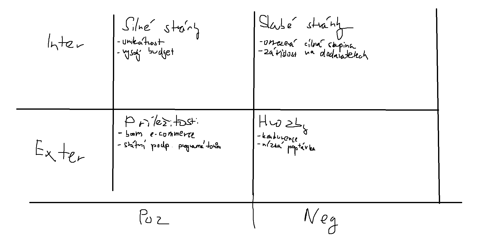

# Úkol

### https://physics.ujep.cz/~jskvor/SZZ/BcAPI/SZZPP/PRIZ.pdf

---

## SMART cíle (z pohledu firmy – zadavatele e-shopu)
1. **Do 2 měsíců** provést **sběr požadavků všech klíčových zainteresovaných osob**, aby vznikl podklad pro návrh řešení.  
   - *Měřitelné:* min. 3 workshopy, písemně zaznamenané požadavky od všech stakeholderů.  

2. **Do 1 měsíce** provést **analýzu požadavků** a vypracovat **low-fidelity wireframe klientské části e-shopu**.  
   - *Měřitelné:* 1 dokument se schválenou analýzou a 1 LF prototyp.  

3. **Do 1 měsíce** dokončit **finální návrh UI/UX** iterativně, s jedním **testem použitelnosti na zadavateli**.  
   - *Měřitelné:* 1 hi-fi prototyp, zpětná vazba zadavatele zapracovaná.  

4. **Do 2 měsíců** mít **vybraného a schváleného poskytovatele hostingu a infrastruktury**.  
   - *Měřitelné:* podepsaná smlouva / objednávka.  

5. **Do 2 měsíců** zrealizovat **funkční prototyp e-shopu** připravený k testování.  
   - *Měřitelné:* implementováno min. 80 % prioritních funkcí (katalog, košík, checkout).  

6. **Do 1 měsíce** provést **funkční testování UI interním týmem**.  
   - *Měřitelné:* report s výsledky testů, ≥ 90 % testovaných případů bez kritických chyb.  

7. **Do 1 měsíce** **odevzdat celý projekt zadavateli**.  
   - *Měřitelné:* protokol o předání + akceptace ze strany zadavatele.  

## SWOT analýza

## RACI analýza

# Analýza rizik projektu – E-shop se žvýkačkami

## Tabulka rizik

| ID  | Riziko                                                   | Pravděpodobnost | Dopad   | Hodnocení | Strategie                        | Odpovědná osoba          | Opatření                                                                 |
|-----|----------------------------------------------------------|-----------------|---------|-----------|----------------------------------|--------------------------|--------------------------------------------------------------------------|
| R1  | Zpoždění vývoje e-shopu kvůli nedostatku programátorů    | Střední         | Vysoký  | Vysoké    | **Snížení**                      | Projektový manažer       | Přidat externí kapacity, detailní plán sprintů, průběžné kontroly        |
| R2  | Překročení rozpočtu (5 mil. Kč)                          | Střední         | Vysoký  | Vysoké    | **Snížení**                      | Finanční manažer         | Rezervní fond, přísná kontrola nákladů, průběžné reporty                 |
| R3  | Technologické selhání (nestabilní e-shop, výpadky serveru)| Nízká           | Vysoký  | Střední   | **Snížení**                      | Architekt systému        | Redundance serverů, cloud hosting, pravidelné testy                      |
| R4  | Nízká poptávka po produktu v online prostředí            | Střední         | Vysoký  | Vysoké    | **Přijetí / Snížení**            | Marketingový manažer     | Intenzivní marketingová kampaň, A/B testování, průzkumy trhu             |
| R5  | Kybernetické útoky a únik dat zákazníků                  | Střední         | Vysoký  | Vysoké    | **Snížení / Přenesení**          | IT bezpečnostní specialista | Nasazení bezpečnostních opatření, penetrační testy, kyber-pojištění   |
| R6  | Odpor zaměstnanců k přechodu na online řešení            | Střední         | Střední | Střední   | **Snížení**                      | Projektový manažer       | Školení, interní komunikace, zapojení zaměstnanců do změny               |
| R7  | Zpoždění dodávek od externích dodavatelů (platební brána, logistika)| Střední | Střední | Střední   | **Přenesení / Snížení**          | Projektový manažer       | Smluvní sankce, více dodavatelů, záložní řešení                          |
| R8  | Právní rizika (nesplnění legislativních požadavků, GDPR) | Nízká           | Vysoký  | Střední   | **Vyhýbání se / Přenesení**      | Právník                  | Právní audit, konzultace, pojištění odpovědnosti                         |
| R9  | Nekvalitní UX → nízká konverze návštěvníků               | Střední         | Střední | Střední   | **Snížení**                      | UX/UI designer           | Uživatelské testování, sběr zpětné vazby, iterace návrhů                 |
| R10 | Selhání marketingové kampaně (nepřivede zákazníky)       | Střední         | Vysoký  | Vysoké    | **Snížení**                      | Marketingový manažer     | Více kanálů propagace, PPC, sociální sítě, influencer marketing          |

---

## Legenda
- **Pravděpodobnost:** Nízká / Střední / Vysoká  
- **Dopad:** Nízký / Střední / Vysoký  
- **Hodnocení:** kombinace pravděpodobnosti a dopadu  
- **Strategie:** Přijetí, Přenesení, Vyhýbání se, Snížení  
