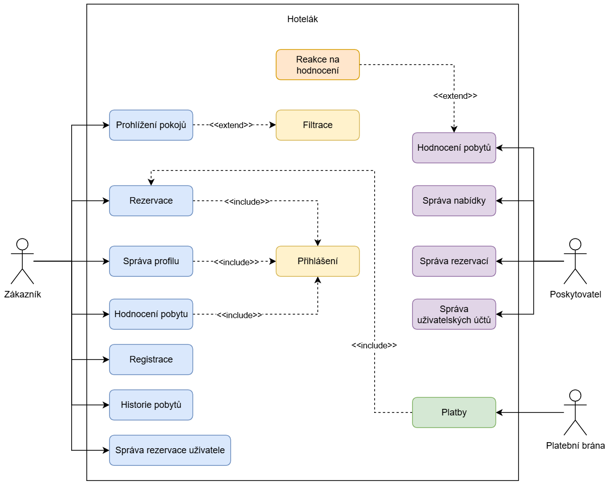
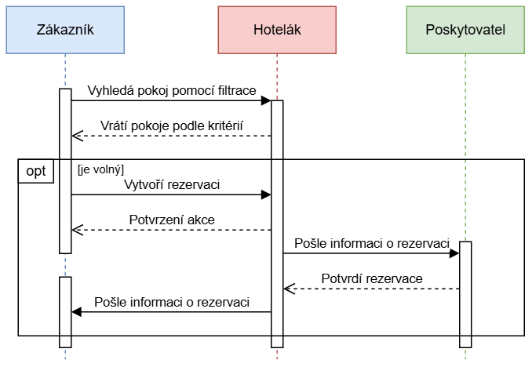

# Návrh rezervačního systému pro malé hotely a penziony

### Popis úlohy:
Navrhněte aplikaci pro rezervaci pokojů v malých hotelech a penzionech. Aplikace bude
zahrnovat funkce pro vyhledávání pokojů, rezervaci, správu profilu uživatele a možnost
poskytování zpětné vazby na ubytování.

### Požadavky na odevzdání:
Řešitel odevzdá softwarovou dokumentaci, která bude obsahovat systémový návrh ve formátu
UML diagramů a snímky grafického prototypu ze softwaru Figma nebo drátěný model
z libovolné grafické aplikace.

● Povinné UML diagramy: Diagram případů užití, Sekvenční diagram, Diagram Tříd.

● Návrh uživatelského rozhraní musí obsahovat alespoň: hlavní stránku, stránku
rezervace, profil uživatele a formulář pro zpětnou vazbu. Návrh grafického rozhraní
můžete realizovat ve formě webové, stolní nebo mobilní aplikace.

### Uživatelské požadavky:

1. Vyhledávání a rezervace pokojů:

    ○ Umožnit uživatelům vyhledávat pokoje podle data, počtu osob, ceny a dalších
    specifikací (např. wi-fi, snídaně).

    ○ Poskytnout detailní informace o pokoji, včetně fotografií, popisu vybavení
    a recenzí od předešlých hostů.

    ○ Umožnit uživatelům provést rezervaci pokoje, vyplnit potřebné údaje (jako
    jméno, kontakt, případné požadavky) a potvrdit rezervaci.

2. Správa profilu uživatele:

    ○ Umožnit uživatelům vytvořit a spravovat svůj uživatelský profil, včetně
    osobních informací.

    ○ Nabídnout možnost změny hesla a osobních údajů.

    ○ Poskytnout přehled předchozích a naplánovaných rezervací s možností
    zrušení nebo úpravy rezervace.

3. Zpětná vazba a hodnocení:

    ○ Umožnit uživatelům hodnotit a psát recenze na ubytování.

    ○ Zobrazit hodnocení a recenze hotelu/penzionu.

    ○ Poskytnout hotelu/penzionu nástroj pro reagování na recenze a zpětnou
    vazbu.

4. Integrace platebního systému:

    ○ Nabídnout různé platební možnosti, jako jsou kreditní karty, bankovní převody
    a online platební platformy.

5. Uživatelské rozhraní a navigace:

    ○ Vytvořit intuitivní a přívětivé uživatelské rozhraní pro snadnou navigaci
    a používání aplikace

# Řešení
## 1. Use Case Diagram
V následujícím diagramu jsou vyzobrazení aktéři rolí.
<ul>
    <li>Zákazník - uživatel, který by rád využil systém</li>
    <li>Provozovatel - uživatel, spravuje příslušný systém za daný podnik</li>
    <li>Platební brána - služba třetí strany, která poskytuje platbu</li>
</ul>

## 2. Sekvenční diagram - vytvoření rezervace
Následující sekvenční diagram popisuje sled komunikace z pohledu zákazníka, IS Hotelák a poskytovatele. Diagram obsahuje případ, kdy je pokoj volný a uživatel si přeje vytvořit rezervaci.

## 3. Diagram tříd
