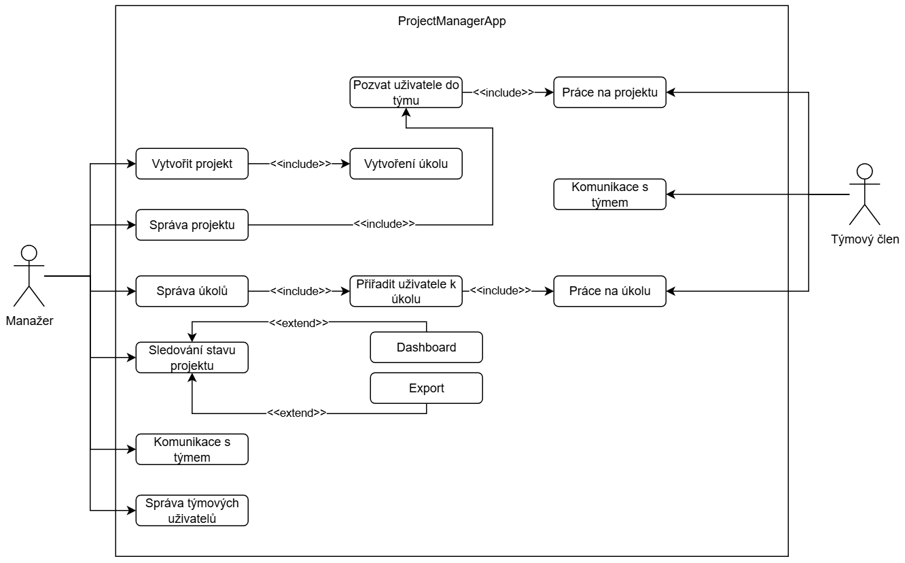
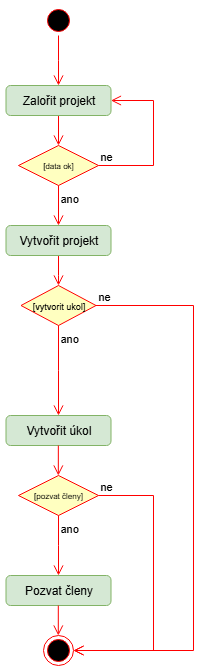
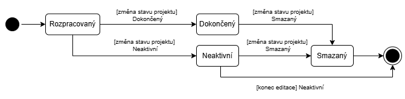

# Návrh rezervačního systému pro malé hotely a penziony

### Popis úlohy:
Navrhněte aplikaci pro správu projektů, která umožní uživatelům vytvářet projekty, přidávat
úkoly, sledovat pokrok a spolupracovat s týmem.
9
Požadavky na odevzdání:
Řešitel odevzdá softwarovou dokumentaci, která bude obsahovat systémový návrh ve formátu
UML diagramů a snímky grafického prototypu ze softwaru Figma nebo drátěný model
z libovolné grafické aplikace.
● Povinné UML diagramy: Diagram Případů užití, Diagram aktivit a Stavový diagram.
● Návrh uživatelského rozhraní musí obsahovat alespoň: Návrh domovské stránky,
stránky projektu, rozhraní pro přidání úkolů a nástěnky pro sledování pokroku.

###Uživatelské požadavky:
1. Vytváření a správa projektů:

    ○ Umožnit uživatelům vytvářet nové projekty, nastavovat jejich názvy, popisy,
    termíny a přiřazovat týmové členy.

    ○ Poskytnout funkci pro editaci a aktualizaci detailů projektu.

    ○ Nabídnout možnost archivovat nebo smazat dokončené či neaktivní projekty.

2. Přidávání a správa úkolů:

    ○ Umožnit přidávat úkoly do projektů, včetně názvů, popisů, priorit, termínů
    a přiřazení konkrétním týmovým členům.

    ○ Poskytnout možnost editace, aktualizace a mazání úkolů.

    ○ Implementovat systém pro sledování stavu úkolů (např. "k provedení", "ve
    vývoji", "hotovo").

3. Kolaborační nástroje a komunikace:

    ○ Nabídnout integrovaný chat pro komunikaci mezi členy týmu uvnitř aplikace.

    ○ Umožnit připojování souborů a odkazů k úkolům a projektům.

4. Sledování pokroku a reporty:

    ○ Implementovat dashboard pro zobrazení aktuálního stavu projektů a úkolů.

    ○ Poskytnout nástroje pro generování reportů o pokroku, včetně grafů
    a statistik.

    ○ Umožnit exportování reportů ve formátech jako PDF nebo CSV.

5. Uživatelské rozhraní a navigace:

    ○ Vytvořit čisté, intuitivní uživatelské rozhraní pro snadnou orientaci a efektivní
    práci.

6. Správa uživatelů a bezpečnost:

    ○ Umožnit vytváření a správu uživatelských účtů, včetně rolí a oprávnění
    v rámci týmu.

# Řešení
## 1. Use Case Diagram

## 2. Activity diagram

## 3. State diagram

